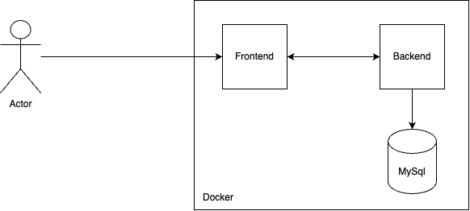

## Guia de Execução

Para executar este código, é necessário ter o Makefile e o Docker instalados no seu sistema.

### Passos para Execução

1. Clone este repositório em sua máquina local.

2. No terminal, navegue até o diretório raiz do projeto.

3. Execute o seguinte comando para iniciar o aplicativo:

```bash
   make start-app
```

Após executar o comando acima, o aplicativo estará acessível em [http://localhost:3000](http://localhost:3000).

Para criar um usuário no software, siga as instruções abaixo:

1. Abra o Postman.
   
2. Importe o arquivo de coleção de requisições fornecido (docs/documentation.postman_collection.json).

3. Procure pela requisição denominada "Login" e faça um POST na API com os detalhes do usuário a ser criado.

4. No frontend, insira o usuário e a senha criados para fazer login no software.

5. Caso for testar os endpoints pelo Postman, é necessário adicionar o novo access_token. Para adicionar, clique em ApiDocumentation -> Variables -> token.

### Diagrama de Arquitetura



### Sugestões de Melhorias

#### Backend:

- Adicionar instrumentação para acompanhamento de métricas.
- Adicionar algum serviço de APM para acompanhamento de erros e exceções.
- Adicionar testes unitários e de integrações.
- Adicionar validações de entradas.
- Adicionar um DTO para o output.
- Adicionar uma lógica de adapters no banco de dados para testar em um CI os testes.

#### Frontend:

- Criar uma verificação se a pessoa realmente deseja excluir o ToDo.
- Criar uma aba para se registrar.
- Adicionar Redux para os métodos CRUD.
- Adicionar um serviço de APM para acompanhamento de erros e exceções.
- Adicionar um serviço de rastreabilidade de tela para entender a dor do usuário.

#### Arquitetura:

- Conforme o sistema crescer, seria interessante adicionar um CACHE no backend para não fazer tantas requisições no banco de dados.
- Adicionar um broker para não correr o risco de perder informações em uma possível falha.
- Adicionar um Traefik/Apache/Nginx na borda para criar um fluxo de proxy-reverso.
- Criar um modelo para ver possíveis falhas de segurança.
- Criar um monitoramento baseado em SLI, SLO e Error Budget afim acompanhar a saúde da aplicação.
